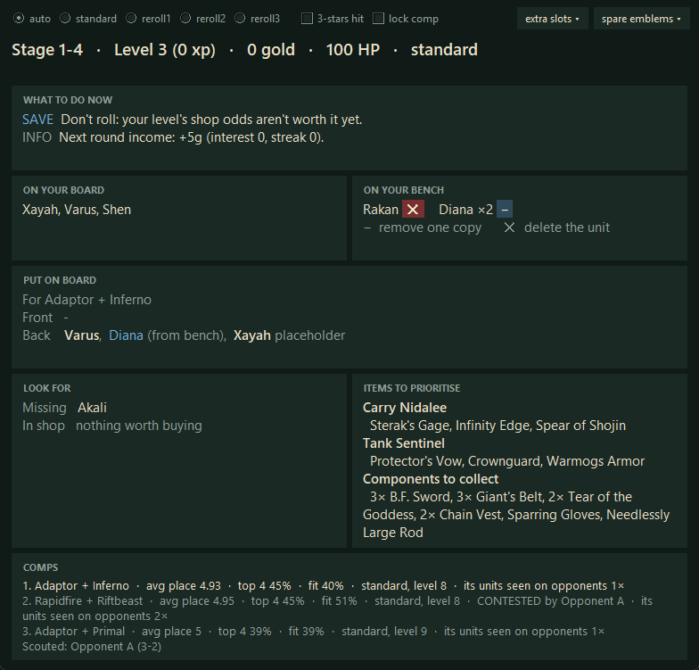

# TFT Coach

A personal desktop coach for **Teamfight Tactics**. It watches your screen while you play and shows, in a
window on your second monitor:

- when to **level, roll or save** gold, based on your stage, level, XP, gold, HP and streak
- which **meta comp** fits what you already have, built from recent Challenger matches
- what is **on your board** and **on your bench**
- which units to **put on board** right now (from your board, bench and current shop)
- which units to **look for** next, and which shop cards are worth buying
- which **items and components** to prioritise for the comp's carry and tank
- which comps and units your **opponents** are already playing (from boards you scout)



> **How it reads the game:** only by looking at the pixels on your screen, like a screenshot tool.
> It never reads the game's memory, never modifies the client and never clicks or types for you.

---

## Contents

- [Requirements](#requirements)
- [Setup](#setup)
- [Running the coach](#running-the-coach)
- [Reading the window](#reading-the-window)
- [Controls](#controls)
- [Scouting opponents](#scouting-opponents)
- [Keeping the meta data fresh](#keeping-the-meta-data-fresh)
- [How it works](#how-it-works)
- [Limitations](#limitations)
- [Configuration](#configuration)
- [Other screen resolutions](#other-screen-resolutions)
- [Development](#development)
- [Disclaimer](#disclaimer)

---

## Requirements

- **Windows** (built and tested on Windows 11)
- **Python 3.12 or newer** (tested on 3.14)
- **TFT at 2560×1440** in borderless or fullscreen mode. Other 16:9 resolutions should work but are
  untested; see [Other screen resolutions](#other-screen-resolutions).
- A **second monitor** is recommended. The window opens there automatically if one exists.
- A **Riot Games API key**, used to download Challenger matches for the meta comps (free, see below).

## Setup

### 1. Get the code and install dependencies

```powershell
git clone https://github.com/wbLoki/tft-coach.git
cd tft-coach
python -m venv .venv
.venv\Scripts\python -m pip install -r requirements.txt
```

The text recognition engine (RapidOCR) downloads with the dependencies; no separate install is needed.

### 2. Add your Riot API key

1. Sign in at [developer.riotgames.com](https://developer.riotgames.com) with your Riot account.
2. Copy the **development key** from your dashboard. It expires after 24 hours. For a key that doesn't
   expire, register a **Personal** product on the portal.
3. Create a file called `.env` in the project folder:

   ```
   RIOT_API_KEY=RGAPI-your-key-here
   ```

The `.env` file is ignored by git, so the key is never committed.

**Not on EUW?** Add your platform and region to `.env`:

```
RIOT_PLATFORM=na1
RIOT_REGION=americas
```

| Server | `RIOT_PLATFORM` | `RIOT_REGION` |
|---|---|---|
| EU West | `euw1` (default) | `europe` (default) |
| EU Nordic & East | `eun1` | `europe` |
| North America | `na1` | `americas` |
| Korea | `kr` | `asia` |
| Brazil | `br1` | `americas` |

### 3. Build the meta data

```powershell
.venv\Scripts\python -m tft_coach.meta
```

This downloads the recent ranked games of the top 40 Challenger players on your server (about 250 matches,
roughly 6 minutes with a personal key's rate limit), plus unit and item names from
[CommunityDragon](https://www.communitydragon.org/). It writes `data/meta.json` and `data/static.json`.

## Running the coach

```powershell
.venv\Scripts\python -m tft_coach.live
```

Start it before or during a game. It reads your screen about once a second. Until it sees the gold and
level bar at the bottom of the screen, it shows "Waiting for a game".

There is also a manual mode for trying the econ advice without a game:

```powershell
.venv\Scripts\python -m tft_coach --stage 4-2 --level 7 --xp 20 --gold 54 --hp 62
```

## Reading the window

| Section | What it shows |
|---|---|
| **Status line** | Stage, level, XP, gold, HP and the strategy in use. Notices appear underneath in orange, for example during augment selection or while scouting. |
| **What to do now** | `LEVEL`, `ROLL`, `SAVE` and `INFO` advice: standard levelling timings, interest breakpoints, slow-rolling for reroll comps, and rolling down when HP is low. |
| **On your board** | Units on your board, worked out from the trait panel (see [How it works](#how-it-works)). |
| **On your bench** | Units the app has seen you buy or move off your board. Use the buttons to correct it. |
| **Put on board** | The front and back row to field for the top comp, chosen from your board, bench and shop. Blue = from your bench, green = buy from the shop, red = off-comp (field it for now, replace later). *Placeholder* = shares the comp's traits but isn't in its final board. |
| **Look for** | The comp's units you're still missing for your level, and shop cards worth buying. "(2 opp.)" means two scouted opponents field that unit. |
| **Items to prioritise** | The best items for the comp's carry and main tank, and the components to collect for them. |
| **Comps** | The top three comps: average placement and top-4 rate in Challenger, how well they fit your traits, how they're played, and whether opponents are on them. |

## Controls

All controls are on the top bar. Everything except the strategy choice resets when a new game starts.

| Control | Use it when |
|---|---|
| **auto / standard / reroll1 / reroll2 / reroll3** | Picks the levelling strategy. `auto` follows the top comp. The reroll options hold you at level 5, 6 or 7 and slow-roll gold above 50. |
| **3-stars hit** | You've finished your reroll. The coach goes back to normal levelling. |
| **lock comp** | You've committed to the current top comp and don't want the suggestions to switch. |
| **extra slots** | You have a Tactician's Cape or Crown, or an augment that adds team size. Raises the number of units it suggests fielding. |
| **spare emblems** | You hold an emblem you haven't equipped yet. Tick its trait so comps using it rank higher. Untick it once the emblem is on a unit, because the game then counts it in the trait panel. |
| **− / ✕ on the bench** | The bench list is wrong. **−** removes one copy; **✕** (shown when one copy is left) deletes the unit. |

## Scouting opponents

Click an opponent's portrait as you normally would to view their board, and **stay on it for 2-3 seconds**.
The status line shows "Scouting *name*: recorded". The coach then:

- works out the opponent's units from their trait panel
- marks comps they're on as **CONTESTED** and ranks them lower
- marks units they field in **Look for**, and ranks comps lower when their core units are drained

Scouting information is as fresh as your last look at that board.

## Keeping the meta data fresh

Re-run the meta build after each patch or every few days:

```powershell
.venv\Scripts\python -m tft_coach.meta              # download new matches and rebuild
.venv\Scripts\python -m tft_coach.meta --no-fetch   # rebuild from matches already downloaded
```

Downloaded matches are cached in `data/matches/`, so later runs only fetch new games. When the API key
has expired, the script says so; paste a new one into `.env`.

## How it works

**Reading the screen.** The coach captures your main monitor once a second and runs text recognition
(RapidOCR) on fixed regions: stage, level, XP, gold, streak, the shop's unit names, the trait panel and the
player list. The regions were measured on a 2560×1440 screenshot and scale with your resolution.

**Your board from your traits.** Units have no names on screen, but every unit has a known set of traits.
The coach searches for the combination of units whose traits add up exactly to the counts in your trait
panel. Usually only one combination fits. When several fit, it reports only the units common to all of
them.

**Your bench from your purchases.** The bench can't be read at all, so the coach infers it. A shop card
that disappears while your gold drops by exactly its cost was bought. A unit that leaves your board
without matching sale gold was moved to the bench. Gold that rises mid-round with the shop unchanged is
treated as a sale.

**Meta comps.** Challenger boards are grouped by their two strongest traits. For each group the coach
records average placement, top-4 rate, usual final level, core units, how often each unit is three-starred
(which identifies reroll comps), and which items each unit holds. Units mostly given tank items go in the
front row. Placeholders are cheap units outside the final board that share the comp's traits.

**Ranking comps.** A comp scores higher when your traits overlap with it, when it places well, and when you
hold a spare emblem for one of its traits. It scores lower when scouted opponents are on it or field its
core units.

## Limitations

- **Bench tracking misses units that don't come through the shop:** carousel picks, loot orbs, augment
  rewards, and anything bought before the coach started. They appear once you've fielded them and moved
  them back. Correct mistakes with the − and ✕ buttons.
- **Board detection fails when the traits don't add up**, for example with an equipped emblem or when you
  have more traits than the panel shows without scrolling. The window then says so and shows the comp's
  ideal board instead.
- **No star levels.** The coach knows which units you field, not how many copies or which star level.
- **Items aren't read.** Use the *spare emblems* and *extra slots* controls instead.
- **Early boards are estimates.** Riot's match data only records final boards, so the board for levels
  below the comp's final level is its cheapest final units plus placeholders.
- **Front/back row is approximate.** It's based on items and traits; melee carries built with damage items
  end up in the back row.
- **Comp grouping is crude.** Grouping by the two strongest traits sometimes splits one comp into
  near-duplicates, and comps with fewer than about 20 games have noisy stats.
- **HP and traits refresh every 8 seconds**, because those reads are slower.

## Configuration

Set-specific numbers live in `data/set_data.json`. **Check them against the patch notes at the start of
each set**, because the econ advice depends on them:

| Key | Meaning |
|---|---|
| `xp_to_next_level` | XP needed for each level |
| `shop_odds` | Shop odds (%) for 1- to 5-cost units at each level |
| `copies_per_unit`, `units_per_cost` | Pool sizes |
| `streak_gold` | Streak length → bonus gold |
| `level_tempo` | The stage at which the coach recommends reaching each level |
| `tank_items`, `frontline_traits` | Used to decide front row versus back row |

Tuning weights (how much placement, emblems and contested comps count) are constants at the top of
`tft_coach/comps.py`.

## Other screen resolutions

Screen regions are defined for 2560×1440 in `tft_coach/reader.py` and scaled to the size of your capture.
Other 16:9 resolutions (1920×1080, 3840×2160) should line up but haven't been tested. Ultrawide and 16:10
layouts won't line up without new measurements.

To check a resolution, take a full-screen screenshot during the planning phase and run:

```powershell
.venv\Scripts\python -m tft_coach.reader your-screenshot.png
```

It prints every field it reads (stage, level, XP, gold, streak, HP, traits, shop). If a field is wrong or
empty, adjust that region in `REGIONS` in `reader.py`.

## Development

```
tft_coach/
  live.py      the coach window and per-game state (board, bench, scouting)
  reader.py    screen reading: regions, OCR, trait panel, player list
  advisor.py   level / roll / save rules
  econ.py      interest, streak gold, XP costs, shop-odds maths
  comps.py     comp ranking, board inference, board plans, items
  meta.py      Riot API download and meta build
data/
  set_data.json  set-specific numbers (committed)
  meta.json      built meta comps (generated)
  static.json    unit, trait and item names from CommunityDragon (generated)
tests/           unit tests
```

Run the tests with:

```powershell
.venv\Scripts\python -m unittest discover -s tests
```

## Disclaimer

TFT Coach isn't endorsed by Riot Games and doesn't reflect the views or opinions of Riot Games or anyone
officially involved in producing or managing Riot Games properties. Riot Games, and all associated
properties are trademarks or registered trademarks of Riot Games, Inc.

This is a personal project. It only reads pixels from your own screen, but Riot's policies on third-party
tools can change; check the current [developer policies](https://developer.riotgames.com/policies/general)
before relying on it. Use it at your own risk.
